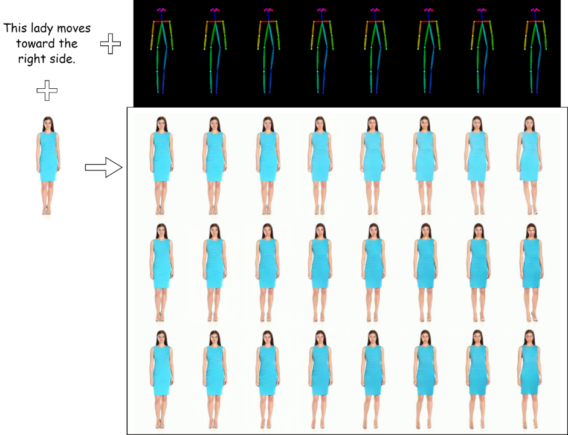

<h3>X2Fashion: Multimodal Fashion Video Synthesis with Pose, Image, and Text Guidance while Ensuring Temporal Consistency</h3>

<p>
This repository has the official code for 'X2Fashion: Multimodal Fashion Video Synthesis with Pose, Image, and Text Guidance while Ensuring Temporal Consistency'. 
We have included the pre-trained checkpoint, dataset and results.   
</p>

> **Abstract:** *Generating videos under multiple control conditions has always been a challenging task. In this paper, we introduce a novel method for text-adjusted video generation, leveraging multimodal control conditions to achieve more diverse fashion video synthesis. By integrating pose sequences, source images, and motion text descriptions, our approach enables the generation of videos that retain the source character's appearance while flexibly adjusting motion based on text semantics. To address temporal continuity and the synchronization of appearance and motion semantics, we introduce appearance and pose encoders, along with temporal modules. These innovations allow our network to produce continuous and consistent videos, enhancing the alignment of generated videos with user intentions. Experimental results on the Fashion-text2video dataset demonstrate that our method effectively generates smooth, coherent motion videos that meet the specified control conditions and successfully align with the provided text semantics.*

<!-- Results -->

## Teaser




## Requirements
- Python 3.9
- PyTorch 1.11+
- TensorBoard
- cv2
- transformers
- diffusers


## Installation

Clone this repository:

```
git clone ...
cd ./x2fashion/
```

Install dependencies:

```
pip install -r requirements.txt
```

## Model Specification

The model was developed using PyTorch and loads pretrained weights for VAE and CLIP. The latent diffusion model consists of a 1D convolutional layer stacked against a 2D convolutional layer (forming a pseudo 3D convolution) and includes attention layers. 

<!-- See the ```model_structure.txt``` file to see the exact layers of our LDM. -->

## Dataset Preparation


<!-- You can download our processed dataset from [here](). -->

<!-- After downloading the dataset, unzip the file and put them under the dataset folder with the following structure: -->

Download our processed Fashion dataset by clicking on this link: 
[[Fashion dataset]](https://pan.baidu.com/s/1YNc1KzWjpuEaSh1F82PsuA?pwd=1230).


Extract the files and place them in the ```fashion_dataset``` directory. The dataset should be organised as follows:

```
fashion_dataset
├── fashion_crop
    ├── xxxxxx
        ├── 000.png
        ├── 001.png
        ├── ...
    ├── xxxxxx
├── fashion_poses
    ├── xxxxxx
        ├── 000.png
        ├── 001.png
        ├── ...
    ├── xxxxxx
    ├── xxxxxx
├── test
    ├── xxxxxx.txt
    ├── xxxxxx.txt
    ├── ...
├── train
    ├── xxxxxx.txt
    ├── xxxxxx.txt
    ├── ...
```

We refer to the [Fashion-Text2Video](https://github.com/yumingj/Fashion-Text2Video)  Dataset. You can also download the original dataset directly. Click [here](https://drive.google.com/drive/folders/1NFd_irnw8kgNcu5KfWhRA8RZPdBK5p1I?usp=sharing) .


## Pre-trained Checkpoint

Download the checkpoint by clicking on this link: 
[Pre-trained checkpoints](https://drive.google.com/drive/folders/1i0qVrFJtImBh7im-X-QMquK_W-0js9kC) .
Extract the files and place them in the ```pretrained_model``` directory

## Inference
To run the inference of our model, execute ```python inference.py```. The results will be saved in the ```result``` directory.

Feel free to add your own dataset while following the provided file and folder structure.

## Train

Before training, images and videos have to be projected to latent space for efficient training. Execute ```python project_latent_space.py``` where the tensors will be saved in the ```fashion_dataset_tensor``` directory.

Run ```python -m torch.distributed.launch --nproc_per_node=<number of GPUs> train.py``` to train the model. The checkpoints will be saved in the ```checkpoint``` directory periodically. Also, you can view the training progress using tensorboardX located in ```video_progress``` or find the generated ```.mp4``` on ```training_sample```.
